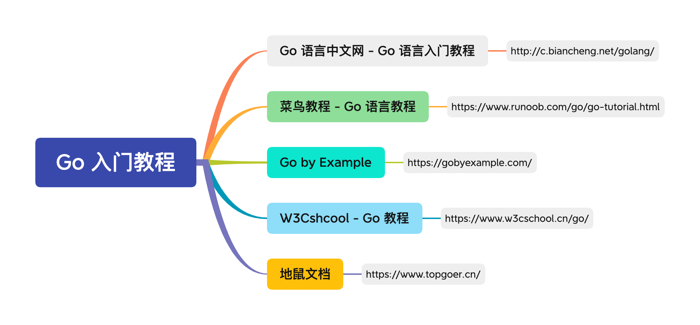
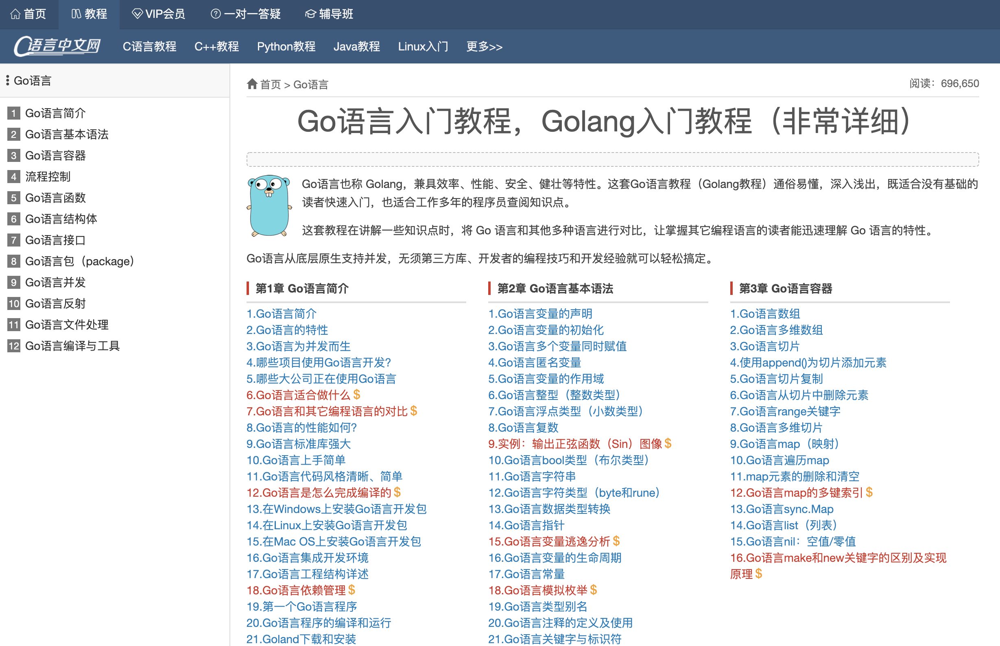

Go 语言的发展越来越好了，很多大厂使用 Go 作为主要开发语言，也有很多人开始学习 Go，准备转 Go 开发。
那么，怎么学呢？

我发现，在互联网时代，学习的困难不是说没有资料，而是资料太多，不知道应该看哪个，从哪开始看。
所以，我整理了一份 Go 学习路线，这份学习路线不以数量取胜，努力做到精简。从基础到进阶，从理论到实战，一共包括以下几个内容：

- 入门教程
- 进阶教程
- 书籍推荐
- Web 开发
- 练手项目
- 实用工具
- 技术社区

这份学习路线还会不断优化更新，感兴趣的同学可以收藏这个链接：[https://github.com/yongxinz/gopher](https://github.com/yongxinz/gopher)，第一时间获取最新资源，如果能给个 **star** 那就太谢谢了。

## 入门教程

### Go 语言中文网 - Go 语言入门教程

**网站链接：** [http://c.biancheng.net/golang/](http://c.biancheng.net/golang/)

这套 Go 语言教程通俗易懂，深入浅出，既适合没有基础的读者快速入门，也适合工作多年的程序员查阅知识点。

### 菜鸟教程 - Go 语言教程

**网站链接：** [https://www.runoob.com/go/go-tutorial.html](https://www.runoob.com/go/go-tutorial.html)

这个网站就不需要多介绍了吧，很多编程语言的入门教程都可以在这里找到。平时写代码过程中，某个知识点忘了，也可以到这里查。

### W3Cshcool - Go 教程

**网站链接：** [https://www.w3cschool.cn/go/](https://www.w3cschool.cn/go/)

也是一个综合性的编程入门教程网站，资料很多，也都很基础。

### Go by Example

**网站链接：** [https://gobyexample.com/](https://gobyexample.com/)

很多代码示例，学习基础知识的时候很实用。可以一边看理论，一边参考这个网站写代码，效果会更好。

### 地鼠文档

**网站链接：** [https://www.topgoer.cn/](https://www.topgoer.cn/)

可以说是 Go 编程的导航网站了，收藏了很多 Go 学习资料。包括网站，书籍，开源库，开源项目等。

## 进阶教程
### mojotv 博客

**网站链接：** [https://mojotv.cn/](https://mojotv.cn/)

很不错的博客，里面很多 Go 进阶文章，还有其他方面的技术文章，值得一读。我试图找了一下作者信息，但是没找到。

### 煎鱼 - Go 语言设计哲学

**网站链接：** [https://golang3.eddycjy.com/](https://golang3.eddycjy.com/)

煎鱼大佬的博客，结合官方资料和作者自己的理解，梳理出的一系列 Go 语言设计相关的理念和哲学的文章。

### 面向信仰编程 - Go 语言设计与实现

**网站链接：** [https://draveness.me/golang/](https://draveness.me/golang/)

左神的博客，内容很深，想要成为大神的话，绝对要来看。

### Go 夜读

**网站链接：** [https://talkgo.org/](https://talkgo.org/)

这是一个由众多资深 Gopher 组织的开源项目，主要是对 Go 源码进行解读。并且坚持开源，将相关资源都上传到了 GitHub。

## 书籍推荐

书单一共包含 10 本书，分为入门 5 本，进阶 5 本。我读过其中 7 本，另外 3 本虽然没读过，但也是网上推荐比较多的。
虽然分了入门和进阶，但是很多书中这两部分内容是都包含了的。大家看的时候可以根据自己的情况，先打好基础，再进行进阶。
有的书是开源的，可以直接在线阅读，有的有电子书，大家可以在这里 GitHub 找到下载方式。如果条件允许的话，买正版是最好的。

### 入门

#### 《Go语言趣学指南》

本书是一本面向 Go 语言初学者的书，内容也比较浅，非常适合入门。

书中循序渐进地介绍了使用 Go 语言必需知道的知识，展示了非常多生动有趣的例子，并通过提供大量练习来加深读者对书中所述内容的理解。

#### 《Go 入门指南》

这本书的英文名称叫《The Way to Go》，作者利用业余时间来进行翻译工作。在取得原作者 Ivo Balbaert 授权的情况下，将其开源。

**在线阅读：** [https://github.com/Unknwon/the-way-to-go_ZH_CN](https://github.com/Unknwon/the-way-to-go_ZH_CN)

#### 《Go 语言编程》

本书以介绍 Go 语言特性为主，示例则尽量采用作者平常的实践，而不是一个没有太大实际意义的语法示范样例。通过与 C++ 和 Java 做一个横向比较，可以更直观看出其设计理念的差别。

作者许式伟为原金山 WPS 首席架构师、曾是盛大创新院研究员，目前是国内 Go 语言实践圈子公认的 Go 语言专家。参与本书写作的几位作者都是实际用 Go 语言开发的项目的开发人员，有较强的实战经验。

#### 《Go 语言 101》

是一本着墨于 Go 语法语义以及运行时相关知识点的编程指导书（Go 1.17 就绪）。此书旨在尽可能地帮助 Go 程序员更深更全面地理解 Go 语言。

此书也搜集了 Go 语言和 Go 编程中的很多细节，其中有一些在官方文档中从未提及。

此书同时适合 Go 初学者和有一定经验的 Go 程序员阅读。

**在线阅读：** [https://gfw.go101.org/article/101.html](https://gfw.go101.org/article/101.html)

#### 《Go 语言程序设计》

本书由作者 Kernighan 和谷歌公司 Go 团队主管 Alan Donovan 联袂撰写，是学习 Go 语言的指南级书籍。内容翔实全面，涵盖了全部基础内容，值得一读。

### 进阶
#### 《Go 语言实战》

相比于其他技术书籍，这本书很薄。显然，这不是面面俱到，涵盖所有知识点的一本书，但它直击要点。

我在阅读过程中，最大的感受就是，很多看基础知识过程中碰到的，又很难通过搜索引擎找到答案的问题，在这里获得了解答。

#### 《Go Web 编程》

学语言不是目的，能够使用这门语言来干活并挣到钱，才是目的。因此，不得不学一下 Go 在 Web 编程方面的应用。

这本书是由黄健宏翻译的，这位译者，还著有《Redis 设计与实现》一书，书中深入浅出地分析了 Redis 所用的数据结构和设计思想，属实优秀。

#### 《Go 语言高级编程》

涵盖 CGO、Go 汇编、RPC 实现、Web 框架、分布式系统等高阶主题。书中章节之间没有很强的关联性，每个章节都是独立的知识，完全可以按需阅读。

**在线阅读：** [https://github.com/chai2010/advanced-go-programming-book](https://github.com/chai2010/advanced-go-programming-book)

#### 《Go 语言学习笔记》

作者是雨痕大佬，2015 年第一届 GopherChina 大会讲师。

本书分上下两卷：

- 上卷细致解析了语言规范相关细节，便于读者深入理解语言相关功能的使用方法和注意事项。
- 下卷则对运行时源码做出深度剖析，引导读者透彻了解语言功能背后的支持环境和运行体系，诸如内存分配、垃圾回收和并发调度等。本书不适合编程初学入门，可供有实际编程经验或正在使用 Go 工作的人群参考。
#### 《Go 语言底层原理剖析》
本书使用浅显易懂的语言与大量图片深入介绍了 Go 语言编译时、类型系统、语法特性、函数调用规范、并发编程、内存管理与垃圾回收、运行状态监控等模块的使用方法和底层原理。

对于想要了解 Go 底层原理，阅读源码的同学来说，可以阅读此书，但想要完全理解书中的内容，并不是一件容易的事。
## Web 开发
Go 是一种开源编程语言，可以轻松构建简单、可靠和高效的软件。也正因为它简单、可靠、高效的特性，在使用 Go 语言开发 Web 应用时有以下的优势：

1. 更简单
2. 更强的编译能力
3. 更高的性能
4. 良好的 IDE 支持和调试功能
5. 语法简单易上手

下面介绍 5 个开源 Web 框架，选择它们的标准是：在 GitHub 上 star 多，维护积极，被使用的多并且查找资料方便。
### Gin

**项目地址：** [https://github.com/gin-gonic/gin](https://github.com/gin-gonic/gin)

一个完全由 Go 语言编写而成的 HTTP Web 框架，提供了一个速度更快的、性能更高的 Go 语言 Web 开发框架。

这个框架对于初学者来说很容易上手，而且在 Web 框架中，star 是最多的，使用的人也非常多。
### Beego
**项目地址：** [https://github.com/beego/beego](https://github.com/beego/beego)

Beego 是一款由 Go 语言开发专家 Asta谢 开发的一款简单易用的企业级 Go 应用开发框架，具备全中文的官方网站和教程。

不同于其他框架语言，Beego 不仅仅提供图文教程，还提供了视频教程，这一点对国内的开发人员来讲是非常友好的。
### Iris
**项目地址：** [https://github.com/kataras/iris](https://github.com/kataras/iris)

Iris 框架在其官方网站上被描述为 Go 开发中最快的 Web 框架，并给出了多框架和多语言之间的性能对比。

如果你正在选择一款性能不错、轻量级且简单易上手的 Go 语言 Web 开发框架，Iris 是一个不错的选择。
### Echo
**项目地址：** [https://github.com/labstack/echo](https://github.com/labstack/echo)

Echo 是个快速的 HTTP 路由器（零动态内存分配），也是 Go 的微型 Web 框架。

其具备快速 HTTP 路由器、支持扩展中间件，同时还支持静态文件服务、WebSocket 以及支持制定绑定函数、制定相应渲染函数，并允许使用任意的 HTML 模版引擎。
### GoFrame
**项目地址：** [https://github.com/gogf/gf](https://github.com/gogf/gf)

GoFrame 是一款模块化、高性能、企业级的 Go 基础开发框架。GoFrame 不是一款 WEB/RPC 框架，而是一款通用性的基础开发框架，是 Golang 标准库的一个增强扩展级，包含通用核心的基础开发组件。

优点是实战化、模块化、文档全面、模块丰富、易用性高、通用性强、面向团队。

总体来说，这个项目具有完善的中文文档和周边开发库，活跃的 issue 讨论区，项目模块化设计很好。

这 5 个开源项目各有优劣，有的已经被市场验证，使用广泛；有的作为后起之秀，发展迅速。

大家可以挑选自己感兴趣的来学习和使用。
## 练手项目
学完了理论，接下来就是实战，开始做项目。除了 Web 开发之外，还有很多方向可以选择，比如 db，cache，im 等等。而且作为练手项目，不能太复杂，否则根本看不懂，反而打击信心，起不到锻炼的效果。

这里我选择了 5 个项目，整体上来说，代码量不是很大，难度也适中。而且不同项目可以学习到不同的技术点，大家可以选择自己感兴趣的来尝试。
### id-maker
**项目地址：** [https://github.com/yongxinz/id-maker](https://github.com/yongxinz/id-maker)

Go 开发的一款分布式唯一 ID 生成系统。

代码量少，项目整体难度小，通过这个项目可以学习到 httpServer，gRPC 相关知识。
### cache2go
**项目地址：** [https://github.com/muesli/cache2go](https://github.com/muesli/cache2go)

比较简单的一个缓存库，代码量很少，适合新手学习。通过这个项目可以学习到锁、goroutine 等知识。
### rosedb
**项目地址：** [https://github.com/flower-corp/rosedb](https://github.com/flower-corp/rosedb)

rosedb 是一个稳定、高性能、快速、内嵌的 k-v 存储引擎，支持多种数据结构，包含 String、List、Hash、Set、Sorted Set，接口名称风格和 Redis 类似。

项目使用纯 Golang 实现，Go 语言的绝大部分基础知识点都包含了，相信一定是学习和巩固 Golang 的很不错的项目。

除此之外，代码中还有一些数据结构的实现，所以同时也能学习一下数据结构的知识。
### wechat-go
**项目地址：** [https://github.com/songtianyi/wechat-go](https://github.com/songtianyi/wechat-go)

这是微信 Web 版 API 的 Go 语言实现，模拟微信网页版的登录／联系人／消息收发等功能，可以完全接管微信收到的消息，并定制自己的发送内容。

我觉得这个项目还是挺有趣的，用来操作一下微信，能够体会到更多学习的乐趣。
### gin-vue-admin
**项目地址：** [https://github.com/flipped-aurora/gin-vue-admin](https://github.com/flipped-aurora/gin-vue-admin)

gin-vue-admin 是一个使用 gin + vue 进行极速开发的全栈后台管理系统，后台使用 gin 框架，前端主要使用 vue。

项目的目录结构非常清晰，包名语义化，能够帮助你快速上手学习。

这个项目还使用到了一些流行的 Go 开源库及中间件，例如：

- gin：最流行的 Go 语言 Web 框架
- gorm：数据库操作中间件
- zap：uber 开源的 Go 语言日志库
- redis：k-v 缓存

除此之外，这个项目还有详细的中文文档，并且配套教学视频，值得学习。
## 实用工具
随着编辑器的逐渐强大，有一些小而美的网站的功能已经被编辑器取代了，但依旧不妨碍我喜欢它们，下面都推荐给大家。
### JSON to Go struct
**网站链接：** [https://mholt.github.io/json-to-go/](https://mholt.github.io/json-to-go/)
### YAML to Go struct
**网站链接：** [https://zhwt.github.io/yaml-to-go/](https://zhwt.github.io/yaml-to-go/)
### Table to Go struct
**网站链接：** [https://github.com/gohouse/converter](https://github.com/gohouse/converter)
使用方式分两种，分别是命令行调用和写 Go 代码。两种方式都不复杂，具体见这篇文章：[推荐三个实用的 Go 开发工具](https://mp.weixin.qq.com/s?__biz=MzI3MjY1ODI2Ng==&mid=2247484135&idx=1&sn=a9be8681908301bb24562cf4ba5cc2a1&scene=21#wechat_redirect)
### Rego
**网站链接：** [http://regoio.herokuapp.com/](http://regoio.herokuapp.com/)
Go 语言正则在线测试。
### plantUML
**网站链接：** [https://www.dumels.com/](https://www.dumels.com/)
这个网站可以分析一个 Go 项目，然后生成接口和结构体的 UML 图。有了这个图之后，基本上也就对项目整体关系有了一个基本概念，再读源码的话，相对来说会容易一些。

具体见这篇文章：[读 Go 源码，可以试试这个工具](https://mp.weixin.qq.com/s?__biz=MzI3MjY1ODI2Ng==&mid=2247484524&idx=1&sn=3d2875c0f1f41767c1a707038be73b4b&scene=21#wechat_redirect)
### Playground
**网站链接：** [https://go.dev/play/](https://go.dev/play/)

Go 语言代码在线运行。
## 技术社区
现在的话，技术社区可能看的人越来越少了，也不那么活跃。从我个人的经验来说，也是这样，有什么问题直接谷歌了，基本不会先到技术社区去查去问。

在这里推荐几个我觉得还不错的，闲暇时间可以逛逛看。

- Go 官网
- Go 官方邮件讨论组
- Go 语言中文网
- Go Forum
- Golang 中国

除此之外，还有两个网站很重要，就是 GitHub 和 stackoverflow。保守估计，这两个网站撑起了程序员一半的工资。
以上就是本文的全部内容，希望各位大佬学的开心。
