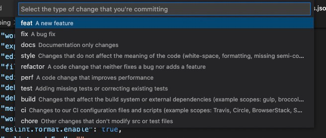
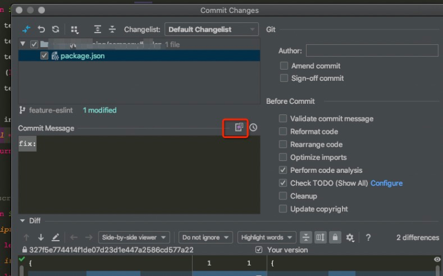
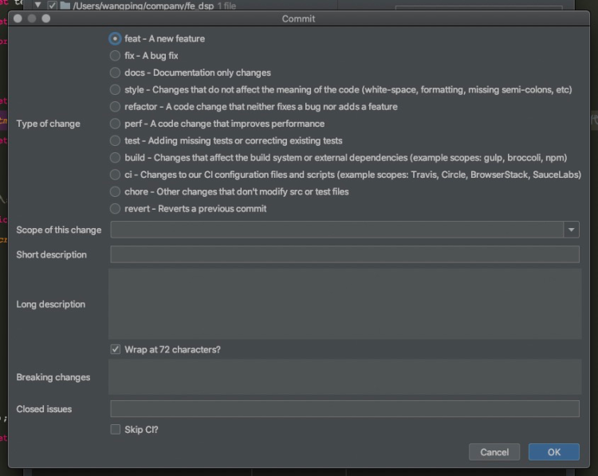

## 前言
当前，前端项目支持代码规范校验、代码格式化已经必不可少，同时需要支持代码提交前对代码格式校验预检查，这里提供一份最简单的配置供大家参考。
## 每个包代表了什么
在配置之前，先了解用实现代码规范化、git 提交信息校验用到的包。
### 1.代码格式规范相关

- ==eslint==：代码格式校验
- ==prettier==：prettier 主要是为了格式化代码，而在没有 prettier 之前，是用 eslint —fix和 编辑器自带代码格式来进行代码格式化的。
- ==stylelint==：css样式格式校验
### 2.代码提交规范相关

- ==lint-staged==：一个在git暂存文件上运行linters的工具，检查本次修改更新的代码，并自动修复并且可以添加到暂存区
- ==husky==: 是一个Git Hook 工具。将其安装到所在仓库的过程中它会自动在 .git/ 目录下增加相应的钩子实现对应的功能，这里我们通过使用husky来监测commit-msg钩子，完成提交信息校验，监测 pre-commit 钩子，完成代码校验。
- ==pre-commit==：git hooks的钩子，在代码提交前检查代码是否符合规范，不符合规范将不可被提交
- ==commit-msg==：git hooks的钩子，在代码提交前检查commit信息是否符合规范
- ==commitizen==：git的规范化提交工具，帮助你填写commit信息，符合[约定式提交](https://www.conventionalcommits.org/zh-hans/v1.0.0/)要求
- ==commitlint==：用于检测提交的信息。
## 代码格式规范配置
### 安装用到的所有包
```bash
npm install -D eslint eslint-config-prettier eslint-plugin-prettier eslint-plugin-html prettier stylelint stylelint-config-prettier stylelint-config-standard husky lint-staged commitizen commitlint-config-cz @commitlint/cli @commitlint/config-conventional
```
**最终package.json文件如下：**
```json
{
  "name": "webpack-demo",    
  "version": "1.0.0",  
  "description": "", 
  "main": "index.js",   
  "scripts": {            
    "dev": "npx cross-env NODE_ENV=development webpack serve --config webpack.dev.js",
    "eslint:fix": "npx eslint --fix --ext \".js,.html\"",         
    "lint": "npx lint-staged",         
    "commit": "npx git-cz",         
    "lint:commit": "npm run lint && npm run commit",         
    "prepare": "husky install"     },
  "keywords": [],     
  "author": "",     
  "license": "ISC",     
  "devDependencies": {         
    "@babel/cli": "^7.13.14",         
    "@babel/core": "^7.13.15",         
    "@babel/eslint-parser": "^7.17.0",         
    "@babel/plugin-syntax-class-properties": "^7.12.13",         
    "@babel/preset-env": "^7.13.15",         
    "@commitlint/cli": "^16.2.1",         
    "@commitlint/config-conventional": "^16.2.1",         
    "autoprefixer": "^9.8.6",         
    "babel-cli": "^6.26.0",         
    "babel-eslint": "^10.1.0",         
    "babel-loader": "^8.2.2",         
    "babel-plugin-transform-runtime": "^6.23.0",         
    "babel-polyfill": "^6.26.0",         
    "babel-preset-env": "^1.7.0",         
    "babel-preset-stage-0": "^6.24.1",         
    "clean-webpack-plugin": "^0.1.19",        
    "commitizen": "^4.2.4",        
    "commitlint-config-cz": "^0.13.3",  
    "compression-webpack-plugin": "^8.0.1", 
    "cross-env": "^7.0.3",   
    "css-loader": "^5.2.1",      
    "eslint": "^8.9.0",     
    "eslint-config-alloy": "^4.4.0",   
    "eslint-config-prettier": "^8.3.0",   
    "eslint-plugin-html": "^6.2.0",   
    "eslint-plugin-prettier": "^4.0.0",    
    "express": "^4.17.1",     
    "file-loader": "^6.2.0",   
    "glob": "^7.1.6",     
    "html-loader": "^0.5.5", 
    "html-webpack-inline-source-plugin": "0.0.10",  
    "html-webpack-plugin": "^5.3.1",   
    "husky": "^7.0.4",     
    "image-webpack-loader": "^4.6.0",      
    "jest": "^27.4.7",      
    "js-conditional-compile-loader": "^1.0.14",    
    "less": "^3.13.1",     
    "less-loader": "^8.1.0",     
    "lint-staged": "^12.3.4",    
    "mini-css-extract-plugin": "^1.4.1",  
    "minimist": "^1.2.5",     
    "optimize-css-assets-webpack-plugin": "^5.0.4",   
    "postcss-loader": "^3.0.0",   
    "prettier": "^2.5.1",      
    "shelljs": "^0.8.4",     
    "style-loader": "^0.23.1",    
    "stylelint": "^14.5.0",      
    "stylelint-config-prettier": "^9.0.3",   
    "stylelint-config-standard": "^25.0.0",  
    "terser-webpack-plugin": "^5.3.0",       
    "uglifyjs-webpack-plugin": "^2.2.0",     
    "url-loader": "^4.1.1",      
    "webpack": "^5.32.0",       
    "webpack-bundle-analyzer": "^4.4.2", 
    "webpack-cli": "^4.6.0",       
    "webpack-dev-server": "^3.11.2",   
    "webpack-merge": "^4.2.2",      
    "webpack-serve": "^4.0.0"     },  
  "browserslist": [        
    "> 1%",        
    "last 2 versions"   
  ],     
  "dependencies": {      
    "core-js": "^3.10.1"   
  },     
  "lint-staged": {    
    "*.{js,html}": [    
      "prettier --write", 
      "eslint --fix"      
    ],       
    "*.css": "stylelint --fix"   
  },   
  "config": {  
    "commitizen": {    
      "path": "./node_modules/cz-conventional-changelog"   
    }    
  } 
}
```
### 配置eslint、prettier、stylelint
eslint 是主要还是负责代码规则校验，prettier 只调整代码风格，代码样式，eslint 才是真正检查代码是否符合规范的工具。两者分工不同，所以需要配合使用。
#### .eslintrc.js
官方文档：[https://eslint.org/](https://eslint.org/)
```javascript
module.exports = {   
  env: {     
    es6: true,   
    node: true,     
    browser: true  
  },   
  extends: [      
    'eslint:recommended', 
    'plugin:prettier/recommended'  
  ],   
  parserOptions: {   
    ecmaVersion: 2018,    
    parser: require.resolve('babel-eslint'),    
    sourceType: 'module'   
  },    
  plugins: [],   
  ignorePatterns: ['.prettierrc.js', '.stylelintrc.js'],  
  rules: {} 
};
```
#### .prettierrc.js
这里根据需要配置具体的规则
官方文档：[https://prettier.io/](https://prettier.io/)
```javascript
module.exports = {      
  printWidth: 100,      
  tabWidth: 4,       
  useTabs: false,      
  semi: true,       
  singleQuote: true,   
  quoteProps: 'as-needed',  
  jsxSingleQuote: false,     
  trailingComma: 'none',    
  bracketSpacing: true,     
  jsxBracketSameLine: false,     
  arrowParens: 'always',     
  rangeStart: 0,   
  rangeEnd: Infinity,    
  requirePragma: false,  
  insertPragma: false,     
  proseWrap: 'preserve',    
  htmlWhitespaceSensitivity: 'css',    
  endOfLine: 'lf'
};
```
#### .stylelintrc.js
这里根据需要配置具体的规则
官方文档：[https://stylelint.io/](https://stylelint.io/)
```javascript
module.exports = {  
  extends: ['stylelint-config-standard', 'stylelint-config-prettier'], 
  plugins: [],  
  rules: {    
    'string-quotes': 'double' 
  }
};
```
:::warning
**1.同时要配置以上三个文件的.ignore文件，并修改 .gitignore 文件，如果不加，会报警告：**  
>warning File ignored by default. Use a negated ignore pattern (like "--ignore-pattern '!<relative/path/to/filename>'") to override
**.gitignore中增加：**
```javascript
!.prettierrc.js 
!.stylelintrc.js 
!.eslintrc.js
```
[参考](https://github.com/eslint/eslint/blob/d31f3370396ec4868722bdc044aa697b135ac183/.eslintignore#L13)

这里只在对应的ignore文件中加入了!，事实证明还是会报同样的警告，必须得加到.gitignore中，方可生效。
:::
::: warning
**2.关于 eslint-plugin-prettier 和 eslint-config-prettier 的配置**

- **eslint-plugin-prettier**

- **作用**:一个形式上跟standard类似的一个代码规则，用来在基础规则上扩展的规则，eslint的rules规则优先级大于prettier的规则。
- **提示**:eslint-plugin-prettier不会为您安装Prettier或ESLint，你必须自己安装。
- **使用prettier的扩展规则有两种方式：**
- **注意**:不需要写`extends:"prettier"`，光下面的配置即可
方式一：
```json
{ 
  "plugins": ["prettier"], 
  "rules": {  
    "prettier/prettier": "error"    
  }
}
```
**方式二：**
```json
extends: [ 'plugin:prettier/recommended', ],
```
**两种区别**:
- 方式一：两种规则会有冲突
- 方式二：两种规则没有冲突，会自动去掉eslint冲突的规则，配置简单。
- **重点：**
如果使用方式二，需同时安装[eslint-config-prettier](https://www.npmjs.com/package/eslint-config-prettier)
- **作用**: 禁用与lint相关的所有格式化规则。
- **注意**
由于编辑器等自动格式化配置设置了走`.prettierrc.js`文件，建议写覆盖的配置，写在这里，不要写在`.eslintrc.js`配置中，否则可能得不到想要的结果。
:::

## 代码提交规范
### 配置husky
运行已经在package.json中增加的 prepare命令，执行 `husky install`
这时会在根目录生成 .husky 文件夹
我们自己增加 commit-msg 、pre-commit 文件，分别为提交前进行eslint校验，和对`git commit-msg`的格式校验
```bash
npx husky add .husky/pre-commit "npx lint-staged"
npx husky add .husky/commit-msg "npx --no -- commitlint --edit $1"
```
**commit-msg ：**
```bash
 . "$(dirname "$0")/_/husky.sh" npx --no -- commitlint --edit $1
```
**pre-commit:**
```bash
 . "$(dirname "$0")/_/husky.sh" npx lint-staged
```
**注意：在有些教程上，我们会看到在package.json中配置如下：**
```json
"husky": {  
  "hooks": {  
    "commit-msg": "npx --no -- commitlint --edit $1",   
    "pre-commit": "npx lint-staged"    
  } 
},
```
而实际如此配置却无法生效，原因为，husky 4版本及以下需要是在package.json中如此配置即可，4版本以上，不需要在此配置，需要执行 `husky install` ，来生成对应的 husky 配置文件。

参考自这里：[https://www.cnblogs.com/ly0612/p/15545803.html](https://www.cnblogs.com/ly0612/p/15545803.html)  
见官方文档：[https://typicode.github.io/husky/#/?id=install](https://typicode.github.io/husky/#/?id=install)
## 代码提交预检查配置
### 配置commitizen
package.json中增加
```json
 "config": {       
   "commitizen": {          
     "path": "./node_modules/cz-conventional-changelog"     
   } 
 }
```
### 配置commitlint
**commitlint.config.js**
```javascript
module.exports = {      
  extends: ['@commitlint/config-conventional'], 
  rules: {
    
  }
};
```
package.json的scripts中增加
```javascript
"commit": "npx git-cz",
```
则可以通过执行 git-cz 命令来进行 commit-msg 格式化选择和提交
### 备注
如果一些特殊情况，需要跳过以上两步校验，可使用命令：
```git
git commit --no-verify -m "xxx"
```
## IDE 配置
让编辑器支持代码自动格式化，可以减少我们提交前代码校验的步骤，以上 git-cz 格式化 commit-msg 提交需要依赖 git 命令输入，如果使用IDE自带的可视化 git 工具提交，都需要ID进行一些配置。
### VS code
#### 支持eslint

1. 安装 "ESLint" 以及 "Prettier - Code formatter" 插件，打开 VSCode 点击「扩展」按钮，搜索 ESLint、prettier，然后安装即可
2. 点击左下角的"齿轮图标"，点击Setting后上端选择Workspace选项卡,（也可以在项目根目录下创建一个配置文件 .vscode/settings.json），添加以下配置：
```json
{       
  "eslint.validate": [      
    "javascript",      
    "javascriptreact",  
    "vue",    
    "typescript",   
    "typescriptreact"  
  ],        
  "editor.codeActionsOnSave": {   
    "source.fixAll.eslint": true,   
    "source.fixAll.stylelint": true    
  },               
  "editor.formatOnSave": true,  
  "editor.defaultFormatter": "esbenp.prettier-vscode",   
  "typescript.tsdk": "node_modules/typescript/lib" 
}
```
#### IDE git commit 支持格式化
在插件库搜索 `Visual Studio Code Commitizen Support` 安装，使用快捷键 `command+shift+P` 即可按规范提交。


### webstorm
#### 支持eslint
webstorm安装prettier、eslint、stylelint插件
设置里搜`File watchs`，增加prettier,打钩开启自动格式化，则会在保存时自动格式化。
#### IDE git commit 支持格式化
插件搜索安装 `convertional commit`，在 VCS 下 `git commit` 时，可以点击提交信息输入框右上角的按钮，选择本次修改类型，如图：




## 参考文章
[https://www.mdnice.com/writing/45c1f9d5fca04b04b443b3275bb5c986](https://www.mdnice.com/writing/45c1f9d5fca04b04b443b3275bb5c986)
[https://blog.csdn.net/qq_33539213/article/details/106215608](https://blog.csdn.net/qq_33539213/article/details/106215608)
