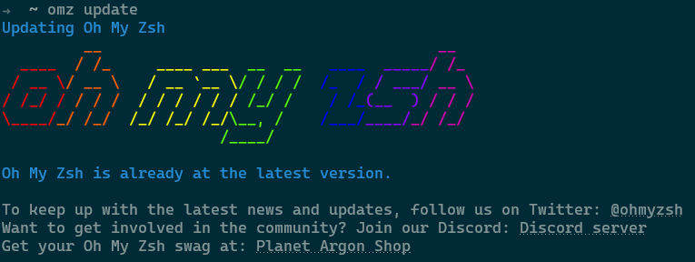
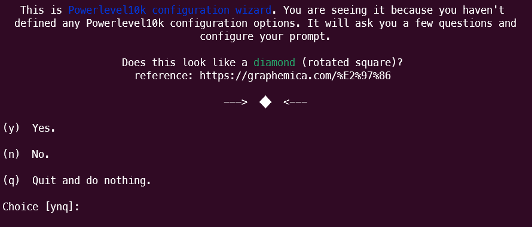
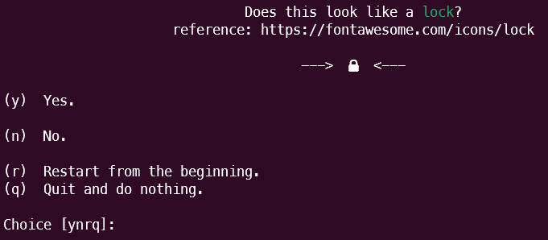
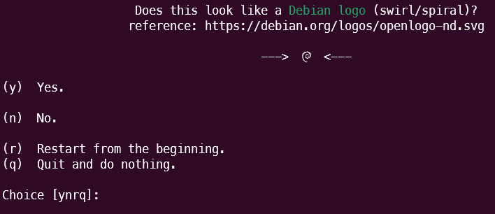
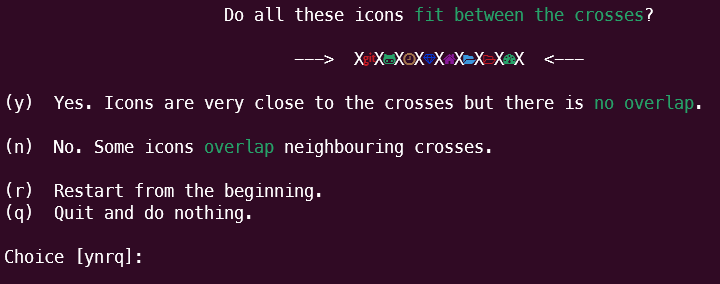

> Zsh 是一个 UNIX 命令解释器 (shell)，可用作交互式登录 shell 和基本脚本执行。 它是 MacOS 的默认 Shell，也可在 Linux/Windows 上使用！ 就像它的邻居 Bash 一样——也来自 UIDA Software。 Zsh 可用于自动执行具有脚本功能的任务，允许您仅通过使用它提供的这些强大功能来编写脚本或程序。 另一个很棒的功能是您不必键入每个 **“＃”** 每个程序的语法一次一行，因为它们都存储在称为标签的变量中，这使得管理大量数据变得容易。

:::tip
在以下教程中，您将学习如何使用命令行终端在 Ubuntu 22.04 LTS Jammy Jellyfish 上安装 Zsh 命令解释器 shell，以及如何启动首次设置以配置您的 zsh 命令行解释器。
:::

---

## 更新Ubuntu
首先，确保您的系统是最新的，以避免使用以下命令发生冲突。
```bash
sudo apt update && sudo apt upgrade
```

---

## 安装 Zsh
第一种也是最简单的方法是使用以下命令直接从 Ubuntu 22.04 默认存储库安装 Zsh。
```bash
sudo apt install zsh -y
```

使用以下命令确认版本。
```bash
zsh --version   # zsh 5.8.1 (x86_64-ubuntu-linux-gnu)
```

指定Zsh为默认shell
```bash
chsh -s /bin/zsh
```

下载oh-my-zsh
```bash
git clone https://github.com/robbyrussell/oh-my-zsh.git ~/.oh-my-zsh
```

修改配置文件并使其生效
```bash
cp ~/.oh-my-zsh/templates/zshrc.zsh-template ~/.zshrc
// 将 ~/.zshrc 中的 plugins=(git) 改为 plugins=(git zsh-autosuggestions)
source ~/.zshrc
```
更新oh-my-zsh
```bash
omz update
```


---

## Powerlevel10k 安装 & 配置 
:::tip
这部分介绍主题`Powerlevel10k`的安装与配置
:::
### Powerlevel10k 安装
GitHub安装
```bash
git clone --depth=1 https://github.com/romkatv/powerlevel10k.git ${ZSH_CUSTOM:-$HOME/.oh-my-zsh/custom}/themes/powerlevel10k
```
国内用户可以使用 [gitee](https://gitee.com/) 上的[官方镜像](https://gitee.com/romkatv/powerlevel10k)加速下载
```bash
git clone --depth=1 https://gitee.com/romkatv/powerlevel10k.git ${ZSH_CUSTOM:-$HOME/.oh-my-zsh/custom}/themes/powerlevel10k
```

---

### Powerlevel10k 配置
编辑 .zshrc 文件， 文件路径 ~/.zshrc
```bash
vim ~/.zshrc  
# 找到这一行，改成这样 ZSH_THEME="powerlevel10k/powerlevel10k"
source ~/.zshrc
```
之后应该会自动启动配置脚本，如果没有启动，请运行命令
```bash
p10k configure
```
然后会出现如下界面，需要回答几个问题  


:::info 这一步问你看到的是不是菱形块，我们选yes，输入y，回车

:::

:::info 问你看到的是不是一把锁的图形，同样输入y

:::
:::info 问你看到的是不是Debian的logo，以上图标如有不太确定的，可以打开提示中的连接进行对比。

:::
:::info 这一步问你看到的图标是否都在X中间
**Y选项** 大致意思是图标非常靠近X，但没有重叠。  
**N选项** 是图标与X重叠。  
根据你自己的情况选择。

:::
之后的一些选项都是主题样式及其他一些个性化设置，根据自己喜好选择即可。
## 安装插件
Oh My Zsh 有非常丰富的[插件](https://github.com/ohmyzsh/ohmyzsh/tree/master/plugins)，使用插件可以使得在终端的效率翻倍，下面介绍 5 个我常用的插件。 插件均需在配置文件 ~/.zshrc 中写出，如下：
```bash
plugins=(
  git
  github
  autojump
  zsh-syntax-highlighting
  zsh-autosuggestions
)
```
### git
提供丰富的 git 别名与几个有用的函数。
### github
 提供几个快捷的函数。
### autojump
 可以记录下来你之前 cd 到访过的所有目录，下次要去那个目录时不需要输入完整的路径，直接 j somedir 即可到达，甚至那个目标目录的名称只输入开头也可以。
[安装方式](https://github.com/wting/autojump#installation)

### zsh-syntax-highlighting
终端命令语法高亮。
```bash
git clone https://github.com/zsh-users/zsh-syntax-highlighting.git ${ZSH_CUSTOM:-~/.oh-my-zsh/custom}/plugins/zsh-syntax-highlighting

plugins=(zsh-syntax-highlighting)
```
### zsh-autosuggestions
 终端命令自动推荐，会记录下来之前使用过的命令，当你输入开头时，会暗色提示之前的历史命令供你选择，可直接按右方向键选中该命令。

```bash
git clone https://github.com/zsh-users/zsh-autosuggestions ${ZSH_CUSTOM:-~/.oh-my-zsh/custom}/plugins/zsh-autosuggestions

plugins=(zsh-autosuggestions)
```
[更多插件，请自行点击查看github。](https://github.com/robbyrussell/oh-my-zsh/tree/master/plugins)
## zsh配置环境变量
这里拿之前装好的anaconda3举例：
```bash
vim ~/.zshrc
```
在其中加入anaconda3的环境变量，路径换成自己的：
```bash
export PATH=/home/liu/anaconda3/bin:$PATH
```

